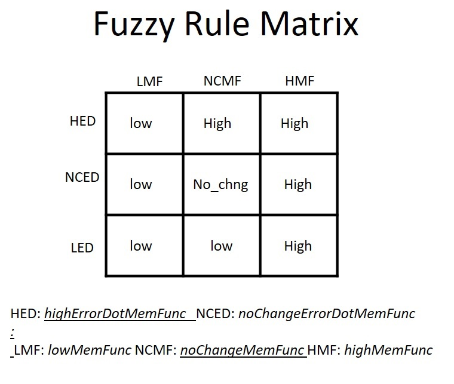
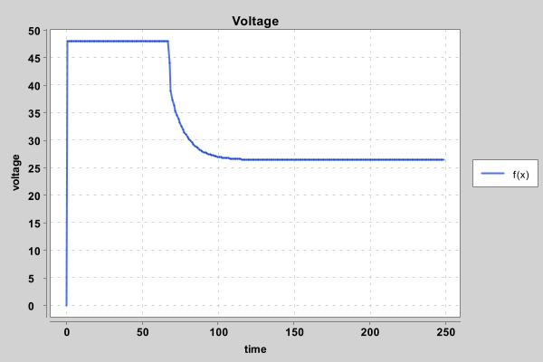

# Fuzzy Logic Level Control of a Cylindrical Water Tank
## Problem Definition

&nbsp;&nbsp; Consider a cylindrical water tank. Water enters the tank from the top at a rate proportional to the voltage, V, applied to the pump. The water leaves through an opening in the tank base at a rate that is proportional to the square root of the water height, H, in the tank. The presence of the square root in the water flow rate results in a nonlinear plant.<br/>

<p align="center"><br/>
 
 The differential equation for the tank is given by: <br/>
 <p align="center"><br/>
   
 where R is the radius of the tank, H is actual water height in the tank, V is the voltage applied to the pump, a (in m^2 per minute) is a constant related to the flow rate out of the tank and b (in m^3 per minute per volt) is a constant related to the flow rate into the tank. The goal is to design a fuzzy logic controller for the pump so that the water level is always at the desired level.<br/>
I am going to simulate my design in these two condition:<br/>
 - **a**: R = 5m, V(max) = 48 volts, a = 0.1, b = 0.01 , Desired Height: *will be given by the user*
 - **b**: R = 5m, V(max) = 48 volts, b = 0.01, Desired Height: *will be given by the user*, a = 0.1 when t(time) <= 20 and a = 0.2 when t > 20<br/>
## Solution
  I used Java for the simulation and followed the principles of Object-Oriented programming in defining the classes and tried to fit it in the following model. <br/>
### Fuzzy Logic Controller 
   A fuzzy controller have the folowing architecture:<br/>
<p align="center"><br/>  
  
&nbsp;&nbsp; I have strictly followed the above architecture. I will briefly explain different parts of the model and how I code it in Java but to better understand it you should already be familiar with fuzzy logic concepts like  fuzzy sets, different types of Membership Functions (MF), and different ways of defuzzification.<br/>
 #### Process or Plant
  &nbsp;&nbsp; Our plant is a Water tank which I have a class with this name in the code. In addition to setters and getters, It has two methods for calculating the **error = currentHeight - desiredHeight** and a method for printing the water tank current situation.


  #### Sensors
 &nbsp;&nbsp; Our sensor here is the above first-order differential equation. Based on the current height of the water tank (which will be determined by the user) and other related parameters, that equation tells us how the level of water will change.<br/>
 &nbsp;&nbsp; The class *Euler* handle this differential equation; It does two jobs: Firstly, It calculate the rate of change in the height which can directly be calculated by the equation, and secondly, it will numerically solve the differential equation and calculate (approximates with high accuracy) the level of the water at a specific time. To numerically solve the above first-order differential equation, I used one of the oldest and easiest methods devised by **Euler** and is called, oddly enough, Euler’s Method. See the following diagram and equation:<br/>
<p align="center"><br/>
<p align="center"><br/>
 
&nbsp;&nbsp;For our problem, I decided to return the height of water every 20 units of time but the step size to go from t to t+20 is 0.0025. As you know and you can also see in the above picture, a smaller step size results in a more accurate approximation.

 #### Fuzzification
  &nbsp;&nbsp; The process of finding the degree of membership of a value in a fuzzy set is called fuzzification which can be done by defining membership functions.<br/>
 In the codes, the class Fuzzification does this process. There are some private methods and one public method (*centerOfGeravity*) in this class. <br/>
 &nbsp;&nbsp; I defined three levels of water namely High, no change, low and a membership function for each of them, and three levels for the rate of change (errorDot).
 I will explain the process by an example. Assume the difference between the current and desired level of water is 2 meters. We pass this number to three different membership functions, *noChangeMemFunc*, *highMemFunc*, and *lowMemFunc* to see how much that difference belongs to those three fuzzy sets. For example, the difference might be considered 75% high, 20% no change, and 5% low. The rate of change in the level of water is also important. I defined three membership functions namely, *noChangeErrorDotMemFunc*, *highErrorDotMemFunc* and lowErrorDotMemFunc to interpret the rate of change. For example, if the rate of change is 0.002, we might interpret it like 30% high, 60% no change, and 10% low. <br/>
 &nbsp;&nbsp; This is a very important part of the design. I interpreted the difference of **one** or more meters as *high* and the rate of change -0.003 or less as a low rate of change and assigned the membership value of **1** (the highest) to both of them but how did I find those numbers? Well, there is no rule to find these numbers. You should find it by trial and error. I looked at the range of returned numbers by the differential equation and the levels of waters we are going to work with and guessed some initial numbers for them, and tuned them after some trial and error.
 #### Inference Engine
&nbsp;&nbsp; The process of drawing conclusions from existing data is called inference. For each rule, the inference engine looks up the membership values in the antecedents of the rule.The membership values are combined by fuzzy conjunction  (fuzzy AND i.e. A AND B = min(A,B)) to evaluate the degree of truth of the rule i. <br/>
We have a rule base in inference engin.<br/>
Look at the following table:
<p align="center"><br/>
 
 &nbsp;&nbsp; We have three sets here. In the codes their names are *lowSet* (Four memebers), *highSet* (four memebers) and *noChangeSet* (one member). This table shows when we interpret the level of the water as *high*, *low*, and *no need to change* which are our *if-then* rules. For example we pass error = 0.5 and errorDot = 0.0002 to membership functions. The membership functions return a number for each category (low, high, no change). Then we perform Fuzzy and between each pair of returned numbers and fill in the table. For example we perform fuzzy AND between the returned numbers from *highErrorDotMemFunc* and *noChangeMemFunc* (i.e. min(highErrorDotMemFunc,noChangeMemFunc) and write the number in the first row and second column of table which is one of the *highSet* members. After performing *AND* between each pair and finding the values of our sets, we need to return just one number for each of them. To do this we calculate the **Root Sum Square** (RSS). It is a statistical method of dealing with a series of values where each value is squared, the sum of these squares is calculated and the square root of that sum is then taken. Now we have one number for each set. Now it is time to defuzzify.
 #### Defuzzification
 &nbsp;&nbsp; Combining inferred MF or aggregated output fuzzy set(RSS) and compute the “fuzzy centroid” of the area to obtain a crisp output is called *Defuzzification*. "Center of Gravity" (CoG) is one of the defuzzification techniques. CoG is most widely used because the defuzzified values tend to move smoothly around the output fuzzy region, thus giving a more accurate representation of a fuzzy set of any shape.<br/>
<p align="center"><br/> 

 
 &nbsp;&nbsp; where X(i) is the center point of the inferred MF and *mu(x)* is the membership value of the inferred MF (i.e. (RSS). The CoG expression gives us the weighted average of the element in the support set. The choice of the center point is up to you and depends on the situation. I chose 100 for high, 0 for co-change, and -100 for low.<br/>
 
 &nbsp;&nbsp;This calculation is in the Fuzzification class. Finally, I use this number to calculate the voltage. Calculating the voltage is in the *Defuzzification* class. It has just one method which calculates the voltage based on the CoG.<br/>
 
 ### Actuator
 &nbsp;&nbsp; The *Actuator* actions were simulated in *PompFuzzyController* class which takes the current and desired level of water and the current-voltage as user inputs and starts the simulation process. Even though the codes can handle any user input but we should know that for part *a* of the problem, the maximum height we can reach is 23.04 meters, and to reach that, we need more time which of course depends on the current level of water (change time in the while loop). that limitation in the height comes from the differential equation that governs the flow of water in the water tank. For the level of water more than 24.03 m, the rate of change will always be negative and it is not possible to increase the level of water. For part two it would be 5.76 meters (after t > 20).<br/>
## Simulation Results
 &nbsp;&nbsp; Here is the result of running the codes:
```
Please enter a positive number for the DESIRED level of water in meter: 7
Please enter a positive number for the CURRENT level of water in meter: 2
Please enter a positive number between 0 and 48 for the CURRENT voltage of pomp: 0
Which part of problem a or b? a
Time: 0.0
===========================================================================================
Desired level of water: 7.0   Current level of water: 2.0   current voltage of pomp: 0.0
===========================================================================================
Time: 1.0
===========================================================================================
Desired level of water: 7.0   Current level of water: 1.964149433650014   current voltage of pomp: 48.0
===========================================================================================
Time: 2.0
===========================================================================================
Desired level of water: 7.0   Current level of water: 2.0503029561815294   current voltage of pomp: 48.0
===========================================================================================
Time: 3.0
===========================================================================================
Desired level of water: 7.0   Current level of water: 2.135693686393039   current voltage of pomp: 48.0
===========================================================================================
Time: 4.0
===========================================================================================
Desired level of water: 7.0   Current level of water: 2.2203435891495924   current voltage of pomp: 48.0
===========================================================================================
```
As you see, based on the user inputs, the actuator sets the voltage to the maximum to increase the level of water.<br/>
 
```
Time: 67.0
===========================================================================================
Desired level of water: 7.0   Current level of water: 6.544572995924887   current voltage of pomp: 48.0
===========================================================================================
Time: 68.0
===========================================================================================
Desired level of water: 7.0   Current level of water: 6.601524550489996   current voltage of pomp: 44.04711731150903
===========================================================================================
Time: 69.0
===========================================================================================
Desired level of water: 7.0   Current level of water: 6.648152186623315   current voltage of pomp: 39.021446157036195
===========================================================================================
Time: 70.0
===========================================================================================
Desired level of water: 7.0   Current level of water: 6.681782226758895   current voltage of pomp: 37.34795127577196
===========================================================================================
Time: 71.0
===========================================================================================
Desired level of water: 7.0   Current level of water: 6.710995412782101   current voltage of pomp: 36.36927946218353
===========================================================================================
Time: 72.0
===========================================================================================
Desired level of water: 7.0   Current level of water: 6.737578979537619   current voltage of pomp: 35.455894843148236
===========================================================================================
Time: 73.0
===========================================================================================
Desired level of water: 7.0   Current level of water: 6.761711933592622   current voltage of pomp: 34.62755495026616
===========================================================================================
Time: 74.0
===========================================================================================
Desired level of water: 7.0   Current level of water: 6.783622531762331   current voltage of pomp: 33.875560425869395
===========================================================================================
Time: 75.0
===========================================================================================
Desired level of water: 7.0   Current level of water: 6.803515757577089   current voltage of pomp: 33.19289098682255
===========================================================================================
Time: 76.0
===========================================================================================
Desired level of water: 7.0   Current level of water: 6.821577712651524   current voltage of pomp: 32.57314481711714
===========================================================================================
Time: 77.0
===========================================================================================
Desired level of water: 7.0   Current level of water: 6.837977289720756   current voltage of pomp: 32.01051228180809
===========================================================================================
```
When the level of water is getting close to the desired level, the actuator gradually decreases the voltage of the pomp to decrease the flow of water in the water tank.
```
Time: 111.0
===========================================================================================
Desired level of water: 7.0   Current level of water: 6.993869050314805   current voltage of pomp: 26.667383391481625
===========================================================================================
Time: 112.0
===========================================================================================
Desired level of water: 7.0   Current level of water: 6.994431706685552   current voltage of pomp: 26.648121844609022
===========================================================================================
....
 
Time: 247.0
===========================================================================================
Desired level of water: 7.0   Current level of water: 6.999999987343087   current voltage of pomp: 26.457513543890688
===========================================================================================
Time: 248.0
===========================================================================================
Desired level of water: 7.0   Current level of water: 6.999999988504485   current voltage of pomp: 26.457513504123106
===========================================================================================
Time: 249.0
===========================================================================================
Desired level of water: 7.0   Current level of water: 6.999999989559214   current voltage of pomp: 26.457513468019254
==========================================================================================
```
The following plots show the changes in the voltage and level of water:<br/>
 
 <p align="center"><br/>
 <p align="center"><br/>
  
 Here is another test when the current water level is more than desired:
```
  Please enter a positive number for the DESIRED level of water in meter: 13
Please enter a positive number for the CURRENT level of water in meter: 19
Please enter a positive number between 0 and 48 for the CURRENT voltage of pomp: 30
Which part of problem a or b? a
Time: 0.0
===========================================================================================
Desired level of water: 13.0   Current level of water: 19.0   current voltage of pomp: 30.0
===========================================================================================
Time: 1.0
===========================================================================================
Desired level of water: 13.0   Current level of water: 18.965446414669422   current voltage of pomp: 3.552713678800501E-15
===========================================================================================
Time: 2.0
===========================================================================================
Desired level of water: 13.0   Current level of water: 18.854711012558685   current voltage of pomp: 0.0
===========================================================================================
Time: 3.0
===========================================================================================
Desired level of water: 13.0   Current level of water: 18.744299838429928   current voltage of pomp: 0.0
===========================================================================================
 ...
  
Time: 55.0
===========================================================================================
Desired level of water: 13.0   Current level of water: 13.44929637293115   current voltage of pomp: 0.0
===========================================================================================
Time: 56.0
===========================================================================================
Desired level of water: 13.0   Current level of water: 13.356059067681606   current voltage of pomp: 4.867548198609654
===========================================================================================
Time: 57.0
===========================================================================================
Desired level of water: 13.0   Current level of water: 13.275521116753907   current voltage of pomp: 14.867548198609654
===========================================================================================
Time: 58.0
===========================================================================================
Desired level of water: 13.0   Current level of water: 13.220687605991786   current voltage of pomp: 20.77831411895756
===========================================================================================
Time: 59.0
===========================================================================================
Desired level of water: 13.0   Current level of water: 13.181072964816625   current voltage of pomp: 26.308524908547582
===========================================================================================
Time: 60.0
===========================================================================================
Desired level of water: 13.0   Current level of water: 13.155656666995453   current voltage of pomp: 29.831885523066568
===========================================================================================
...
  
Time: 247.0
===========================================================================================
Desired level of water: 13.0   Current level of water: 13.0000000034075   current voltage of pomp: 36.05551263880561
===========================================================================================
Time: 248.0
===========================================================================================
Desired level of water: 13.0   Current level of water: 13.000000003094822   current voltage of pomp: 36.05551264954216
===========================================================================================
Time: 249.0
===========================================================================================
Desired level of water: 13.0   Current level of water: 13.00000000281057   current voltage of pomp: 36.05551265912914
===========================================================================================
```
&nbsp;&nbsp; The actuator sets the voltage from 30 to zero to decrease the level of water (at time=1 voltage is 3.552713678800501**E-15** which is actually zero. That small voltage shows the importance of defining the membership functions in the fuzzification stage)  and when the level is getting close to the desired level, it gradually increases the pomp voltage and finally, it sets the voltage to 36.05 to control it at the desired level. See the following charts: <br/>
 
<p align="center"><br/>
<p align="center"><br/>

&nbsp;&nbsp; The fuzzy controller performs well. In my simulation, I did not use the actual unit of time because the problem description does not give us any information about the frequency of changing the voltage in a time interval (i.e. we do not know that we can update the voltage every second or every 10 seconds or anything else).


 

 
 
 
 


 
 
 
   
 
  
